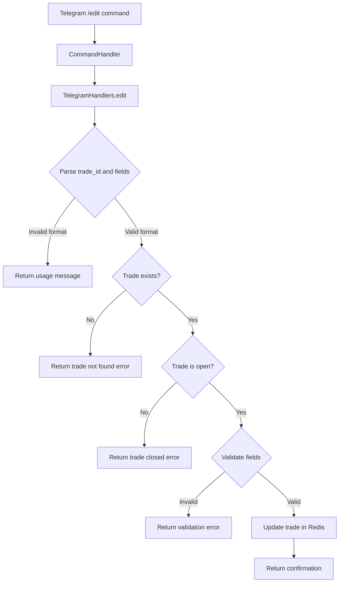

# Design Document: Edit Trade Command

## Overview

This design specifies a new `/edit` command for the BTC Discipline Bot that allows traders to modify previously recorded trades. The feature addresses the user need to correct mistakes in trade entries without manual database intervention.

## Architecture

The edit-trade feature follows the existing command pattern in the bot:

```
Telegram Update → CommandHandler → TelegramHandlers.edit() → RedisRepository.update_trade() → Redis
```

The implementation reuses existing infrastructure:
- **TradeFormService**: For field validation (leveraging existing `TradeDraft` validation)
- **RedisRepository**: For trade persistence and updates
- **Formatting module**: For user-facing messages

### Component Diagram



## Components and Interfaces

### 1. Command Handler (`handlers.py`)

New handler method `edit()` that:
- Accepts command arguments in format `/edit <trade_id> field1=value1 [field2=value2 ...]`
- Parses trade ID and field updates
- Validates trade exists and is open (status OPEN or OPEN_OVERRIDE)
- Validates all provided fields using `TradeDraft` validation rules
- Handles leverage override logic
- Calls repository to update trade
- Returns appropriate message to user

### 2. Repository Method (`repo.py`)

New method `update_trade(trade_id: int, updates: dict)` that:
- Loads existing trade
- Applies field updates while preserving non-editable fields
- Validates invalidation price side against direction
- Handles leverage override reason persistence/clearing
- Updates trade atomically in Redis

### 3. Formatting Functions (`formatting.py`)

New formatting functions:
- `edit_usage()` - Returns command usage message
- `edit_trade_not_found(trade_id)` - Trade not found error
- `edit_trade_closed(trade_id)` - Trade already closed error
- `edit_confirmation(trade, updated_fields)` - Success confirmation
- `edit_validation_error(error, prompt)` - Validation failure

### 4. Help Integration (`formatting.py`)

Update `help_overview()` and `help_map` to include `/edit` command.

## Data Models

### Editable Fields

Based on requirements, these fields can be edited:

| Field | Type | Validation |
|-------|------|------------|
| `direction` | Direction (long/short) | Must be "long" or "short" |
| `size_usdt` | PositiveFloat | > 0 |
| `leverage` | int | 1-125 inclusive |
| `leverage_override_reason` | str | 10-500 chars (required if leverage >= 20) |
| `entry_price` | PositiveFloat | > 0 |
| `invalidation_price` | PositiveFloat | Must be on correct side of entry |
| `max_loss_usdt` | PositiveFloat | > 0 |
| `regime` | Regime | One of: uptrend, range, downtrend, event_risk |
| `thesis` | str | 10-280 characters |

### Non-Editable Fields

These fields cannot be modified after trade creation:

- `id` - Trade identifier
- `opened_at` - Trade open timestamp
- `closed_at` - Trade close timestamp (only set on close)
- `close_price` - Close price (only set on close)
- `realized_pnl` - Realized P&L (calculated on close)
- `status` - Trade status (managed by system)
- `size_reduction_enforced` - Internal flag

### Trade Status Transitions

```
OPEN → OPEN (on edit)
OPEN_OVERRIDE → OPEN_OVERRIDE (on edit)
CLOSED → CLOSED (edits rejected)
```

## Correctness Properties

*A property is a characteristic or behavior that should hold true across all valid executions of a system—essentially, a formal statement about what the system should do. Properties serve as the bridge between human-readable specifications and machine-verifiable correctness guarantees.*

### Property 1: Field preservation

*For any* open trade and any valid subset of editable fields, when an edit command updates only those fields, all non-specified editable fields SHALL remain unchanged in the datastore.

**Validates: Requirements 1.7, 2.9**

### Property 2: Non-editable fields immutable

*For any* trade and any edit command, the non-editable fields (id, opened_at, closed_at, close_price, realized_pnl, status, size_reduction_enforced) SHALL remain unchanged regardless of the edit operation.

**Validates: Requirements 2.9**

### Property 3: Long trade invalidation side

*For any* long trade where `invalidation_price` is being edited (either alone or with `entry_price`), the resulting invalidation_price MUST be less than the entry_price.

**Validates: Requirements 2.5, 4.1, 4.3**

### Property 4: Short trade invalidation side

*For any* short trade where `invalidation_price` is being edited (either alone or with `entry_price`), the resulting invalidation_price MUST be greater than the entry_price.

**Validates: Requirements 2.5, 4.2, 4.3**

### Property 5: High leverage justification requirement

*For any* edit command that sets leverage to a value >= 20, the command MUST include a `leverage_override_reason` with 10-500 characters, otherwise the edit SHALL be rejected.

**Validates: Requirements 3.1**

### Property 6: Leverage reduction clears override reason

*For any* trade with an existing `leverage_override_reason`, when leverage is edited to a value < 20, the leverage_override_reason SHALL be cleared (set to null).

**Validates: Requirements 3.4**

### Property 7: Leverage reason preservation

*For any* open trade with an existing `leverage_override_reason`, when an edit command is issued that does NOT modify the leverage field, the leverage_override_reason SHALL be preserved unchanged.

**Validates: Requirements 3.3**

### Property 8: Field validation rules consistency

*For any* edit command, all edited fields MUST be validated using the same rules as the `/new` command, including: direction (long/short), size_usdt (>0), leverage (1-125), entry_price (>0), max_loss_usdt (>0), regime (valid enum), thesis (10-280 chars), leverage_override_reason (10-500 chars when provided).

**Validates: Requirements 1.6, 2.1-2.8, 3.2**

## Error Handling

### Error Scenarios

| Scenario | HTTP-like Code | Message | User Action |
|----------|---------------|---------|-------------|
| Invalid command format | 400 | Usage instructions | Retry with correct format |
| Trade not found | 404 | "Trade X not found" | Verify trade ID |
| Trade closed | 409 | "Trade X is closed, only open trades can be edited" | Cannot edit |
| Invalid field value | 422 | Specific validation error | Correct the value |
| High leverage no reason | 422 | "Leverage >= 20 requires justification" | Provide reason |

### Validation Error Details

- `direction`: Must be "long" or "short"
- `size_usdt`: Must be greater than zero
- `leverage`: Must be between 1 and 125
- `entry_price`: Must be greater than zero
- `invalidation_price`: Must be on correct side based on direction
- `max_loss_usdt`: Must be greater than zero
- `regime`: Must be one of: uptrend, range, downtrend, event_risk
- `thesis`: Must be 10-280 characters
- `leverage_override_reason`: Must be 10-500 characters when leverage >= 20

## Testing Strategy

### Unit Tests

**Unit tests for specific examples and edge cases:**

1. **Command parsing**
   - Valid format: `/edit 1 size_usdt=1000`
   - Multiple fields: `/edit 1 size_usdt=1000 leverage=10`
   - Invalid format without field: `/edit 1`
   - Invalid format without trade ID: `/edit`

2. **Field validation boundaries**
   - Thesis min length (10 chars)
   - Thesis max length (280 chars)
   - Leverage bounds (1, 125)
   - Regime valid values

3. **Error messages**
   - Trade not found
   - Trade closed
   - Invalid field values

### Property-Based Tests

**Property tests for universal correctness:**

1. **Field preservation**: For any open trade and any valid field update, non-updated editable fields remain unchanged
2. **Invalidation side validation**: For any direction and entry_price, invalidation_price must be on the correct side
3. **High leverage requiring justification**: For any leverage >= 20, edit fails without valid reason
4. **Non-editable fields immutable**: For any edit, id, opened_at, status remain unchanged

### Integration Tests

1. End-to-end edit flow with real Redis
2. Edit followed by close
3. Edit with breach active

### Test Implementation

Use Python's `pytest` with `pytest-asyncio` for async tests. Property-based tests using `hypothesis`:

```python
# Example property test structure
from hypothesis import given, settings, strategies as st

@given(trade=valid_open_trade(), field_updates=valid_field_updates())
@settings(max_examples=100)
async def test_field_preservation(trade, field_updates):
    """For any open trade and field updates, non-updated fields are preserved."""
    updated = await repo.update_trade(trade.id, field_updates)
    for field in EDITABLE_FIELDS:
        if field not in field_updates:
            assert getattr(updated, field) == getattr(trade, field)
```

### Testing Tools

- **pytest**: Test runner
- **pytest-asyncio**: Async test support
- **hypothesis**: Property-based testing
- **redis**: Test Redis instance via docker-compose

### Tag Format

All property tests should include:
```python
# Feature: edit-trade, Property 1: Non-existent trade rejection
```