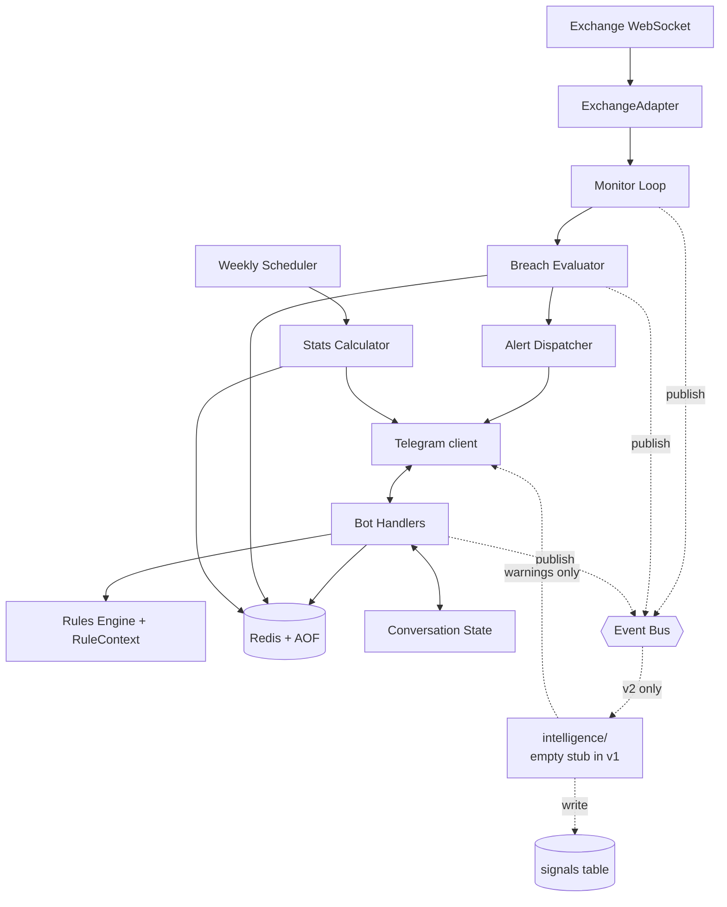

# Design: BTC Discipline Bot

## 1. Technical Summary

A single Python service running two concurrent `asyncio` loops on top of Redis as the shared durable datastore:

- a **Telegram bot loop** that handles user commands and conversational forms,
- a **price monitor loop** that maintains a Binance websocket subscription and evaluates ticks against invalidation levels of every open trade.

Discipline rules (leverage block, size-reduction cap, field validators) live in a pure-Python `rules/` module with no I/O so they can be unit-tested exhaustively. The exchange websocket is hidden behind an `ExchangeAdapter` ABC so Bybit can be added without touching the monitor loop. Deployment is Docker Compose: one bot service container plus one Redis container with host-mounted persistent data.

**Stack:** Python 3.11+, `python-telegram-bot` v20+ (asyncio), `websockets`, `redis.asyncio`, `pydantic` v2, `structlog`, `apscheduler`, `pytest` + `pytest-asyncio`.

## 2. Architecture



- **Frontend:** none. Telegram is the UI.
- **Backend:** single Python process in the bot container with two coroutines, `bot.run_polling()` and `monitor.run()`, sharing the Redis-backed repository and `alert_dispatcher`.
- **Database:** Redis, accessed through `redis.asyncio`, with append-only file persistence and host-mounted data directory.
- **Runtime:** Docker Compose starts the bot service and Redis service on the same private Compose network.
- **API endpoints:** none public. `/health` is a Telegram command.
- **Background jobs:** weekly stats report (APScheduler, Mon 09:00 in configured TZ).
- **External integrations:** Telegram Bot API; exchange public WS.
- **Auth:** Telegram chat ID whitelist enforced via a decorator on every handler.
- **Error handling:** every handler wrapped in top-level try/except; user gets "Internal error, try again", details logged.
- **Observability:** structlog → stdout JSON; stable event names; `/health` command for runtime status.

## 3. Data Model

Redis is the authoritative datastore in v1 for REQ-011. The repository layer owns all key construction, atomic operations, serialization, and versioning. Application modules do not issue Redis commands directly.

### Key namespaces

| Namespace | Type | Purpose |
|---|---|---|
| `seq:trade_id` | string integer counter | Generates monotonically increasing trade IDs via `INCR`. |
| `seq:breach_id` | string integer counter | Generates monotonically increasing breach IDs via `INCR`. |
| `seq:alert_id` | string integer counter | Generates monotonically increasing alert IDs via `INCR`. |
| `seq:signal_id` | string integer counter | Reserved for v2 signal IDs via `INCR`. |
| `trade:{id}` | hash | One committed trade record. |
| `trades:all` | sorted set | Trade IDs scored by `opened_at` epoch seconds. |
| `trades:status:{status}` | set | Trade IDs by status: `OPEN`, `OPEN_OVERRIDE`, `CLOSED`. |
| `trades:closed` | sorted set | Closed trade IDs scored by `closed_at` epoch seconds. |
| `breach:{id}` | hash | One breach record. |
| `breaches:trade:{trade_id}` | sorted set | Breach IDs for a trade scored by `detected_at`. |
| `breaches:unresolved` | set | Breach IDs with no user response. |
| `breach:active:{trade_id}` | string | Current unresolved breach ID for a trade; absent when no active breach exists. |
| `alert:{id}` | hash | One alert record. |
| `alerts:breach:{breach_id}` | sorted set | Alert IDs for a breach scored by `sent_at`. |
| `conversation:{chat_id}` | hash | Persisted form state and partial trade JSON. |
| `signals:{id}` | hash | Reserved for v2 intelligence signals; empty in v1. |
| `signals:active` | sorted set | Reserved active signal IDs scored by `detected_at`; empty in v1. |
| `schema:version` | string integer | Applied datastore schema/key-contract version. |

### Record shapes

`trade:{id}` hash fields:

| Field | Type | Constraint |
|---|---|---|
| `id` | integer | Generated by `seq:trade_id`. |
| `direction` | enum | `long` or `short`. |
| `size_usdt` | float | `> 0`. |
| `leverage` | integer | `1–125`. |
| `leverage_override_reason` | string/null | Required when leverage is blocked and overridden. |
| `entry_price` | float | `> 0`. |
| `invalidation_price` | float | `> 0`; direction-side validation enforced before write. |
| `max_loss_usdt` | float | `> 0`. |
| `regime` | enum | `uptrend`, `range`, `downtrend`, `event_risk`. |
| `thesis` | string | `10–280` chars. |
| `status` | enum | `OPEN`, `OPEN_OVERRIDE`, `CLOSED`. |
| `size_reduction_enforced` | boolean-as-int | `0` or `1`. |
| `opened_at` | ISO-8601 timestamp | Required. |
| `closed_at` | ISO-8601 timestamp/null | Required when closed. |
| `close_price` | float/null | Required when closed. |
| `realized_pnl` | float/null | Required when closed or set by `/setpnl`. |

`breach:{id}` hash fields: `id`, `trade_id`, `detected_at`, `breach_price`, `user_response`, `response_at`, `justification`. `user_response` is one of `closed`, `justified`, `no_response`, or absent/null while unresolved.

`alert:{id}` hash fields: `id`, `breach_id`, `sent_at`, `escalation_level`, `message`.

`conversation:{chat_id}` hash fields: `chat_id`, `state`, `partial_trade_json`, `updated_at`.

`signals:{id}` hash fields are reserved for REQ-010: `id`, `source`, `kind`, `severity`, `detected_at`, `expires_at`, `payload_json`, `summary`. The namespace exists in v1 and remains empty. Only code in `src/intelligence/` may write signal keys.

### Atomicity rules

Redis operations that update multiple keys use `MULTI/EXEC` transactions or Lua scripts. The repository provides atomic methods for:

- creating a trade and updating all trade indexes,
- closing a trade only if status is currently `OPEN` or `OPEN_OVERRIDE`,
- creating a breach only if the trade is still open and has no active unresolved breach,
- resolving a breach and clearing `breach:active:{trade_id}`,
- writing conversation state with a single hash update,
- recording alerts and indexing them by breach.

Pydantic models mirror these Redis record shapes one-to-one (`Trade`, `Breach`, `Alert`, `ConversationState`, `Signal`). Additionally:
- `RuleContext` — dataclass passed to every rule function. Fields: `trade_draft`, `recent_trades`, `signals: Mapping[str, Signal] = {}`. The `signals` field is always empty in v1 (REQ-010).
- `Event` — discriminated union of event types published on the bus (see §13).

## 4. API Design

No HTTP API. The Telegram command surface:

### `/new`
- **Purpose:** start commitment form.
- **Flow:** multi-step conversational; see REQ-001 and §5 state machine.
- **Errors:** "Form already in progress, /cancel first."

### `/closed <price>` or `/closed <id> <price>`
- **Purpose:** mark trade closed.
- **Validation:** price > 0; trade must be `OPEN` or `OPEN_OVERRIDE`.
- **Response:** `"Trade #{id} closed at {price}. Realized P&L: {pnl} USDT. Streak: {streak}."`
- **Errors:** `"No open trade."` / `"Trade {id} not found or already closed."`

### `/justify <reason>`
- **Purpose:** submit breach justification.
- **Validation:** reason ≥ 5 chars; an unresolved breach must exist for the most recent open trade (or the specified trade).
- **Errors:** `"No active breach to justify."`

### `/cancel`
- **Purpose:** cancel in-progress form. No-op if no form active.

### `/open`
- **Purpose:** list trades in `OPEN` or `OPEN_OVERRIDE`.

### `/streak`
- **Purpose:** show consecutive-loss counter and active size cap.

### `/stats [days]`
- **Purpose:** adherence + P&L stats. Default 30 days.

### `/setpnl <trade_id> <pnl>`
- **Purpose:** manual P&L override (fees, partial fills). Recomputes streak.

### `/health`
- **Purpose:** websocket status, last tick age, open trade count, last error.

### `/signals`
- **Purpose:** show active market/news signals from the intelligence layer (REQ-010).
- **v1 behavior:** stub. Replies: `"Intelligence layer not configured. v2 feature — see REQ-010."`
- **v2 behavior (reserved):** queries the `signals` table for non-expired rows, renders the summary lines grouped by source.

### `/help [cmd]`
- **Purpose:** command list, or per-command help.

All commands enforced behind a `@whitelisted` decorator (REQ-NFR security).

## 5. Frontend Design

Telegram is the frontend. The "design surface" is the conversational state machine and message copy.

### `/new` state machine

```
IDLE → DIRECTION → SIZE → LEVERAGE [→ LEV_OVERRIDE] → ENTRY → INVALIDATION
     → MAX_LOSS → REGIME → THESIS → CONFIRM → IDLE
```

- Any state + `/cancel` → IDLE (no trade created).
- Any state + 10-min idle → IDLE (auto-expired; logs "form_abandoned").
- Validation failures stay in the same state and re-prompt.
- Partial state persisted to `conversation_state` so a process restart does not lose mid-form context.

### Copy guidelines

- Prompts: short imperative questions.
- Validation rejections: name the field, the rule, and an example correct value.
- Alerts: 🚨 and ⚠️ used sparingly to avoid desensitization.
- Every confirmation echoes the trade ID and the enforced parameters.

### Accessibility

Telegram handles screen readers. Emoji is never meaning-bearing; always paired with text.

## 6. Backend Design

### Module layout

```
src/
  app.py                # Entrypoint; wires components + event bus
  config.py             # Pydantic Settings (env + .env)
  bot/
    handlers.py         # Command + conversation handlers (incl. /signals stub)
    forms.py            # Form state machine
    formatting.py       # User-facing message templates
    whitelist.py        # @whitelisted decorator
  monitor/
    monitor.py          # Main loop (consumes ticks, fans out, publishes events)
    breach.py           # Pure breach-detection logic
    alerts.py           # Alert dispatcher + escalation
    health.py           # REQ-009 monitor health + heartbeat
  exchange/
    base.py             # ExchangeAdapter ABC
    binance.py          # Binance USDT-M Futures impl
    bybit.py            # Stub for v1.1
  rules/
    leverage.py         # Leverage block
    sizing.py           # Consecutive-loss cap
    validation.py       # Field-level validators
    context.py          # RuleContext dataclass (REQ-010); signals always empty in v1
  models/
    trade.py
    breach.py
    alert.py
    conversation.py
    signal.py           # REQ-010: Signal record model (table empty in v1)
    events.py           # Event type enum + payload dataclasses (REQ-010)
  db/
    keyspace.py         # Redis key builders and key-contract version
    scripts/            # Lua scripts for atomic multi-key state transitions
    repo.py             # All Redis access
  stats/
    calculator.py
    report.py           # Weekly scheduler
  events/
    bus.py              # REQ-010: asyncio pub/sub event bus
  intelligence/
    __init__.py         # REQ-010: empty stub. Docstring declares v2 boundary
                        # and the read-only constraint. No runtime imports
                        # from src/ outside this package in v1.
tests/
  unit/
  integration/
  e2e/
```

### Service boundaries

- `rules/` is pure. No I/O. Hermetic unit tests.
- `db/repo.py` is the only module that touches Redis. All other modules call it.
- `exchange/` adapters depend only on `models/`.
- `bot/` and `monitor/` are independent; they communicate only through the DB and the alert dispatcher.

### Transactions

Each user command and each breach detection is a single repository-level atomic operation where multiple keys must change together. The implementation uses Redis `MULTI/EXEC` transactions or Lua scripts for compare-and-set style status guards.

### Race-condition handling

A tick may arrive while a `/closed` command is mid-commit. Mitigation: the repository uses an atomic Redis transaction or Lua script that first checks `trade:{id}.status` and `breach:active:{trade_id}`. If status is not `OPEN` or `OPEN_OVERRIDE`, or an unresolved breach already exists, the breach write aborts. The `/closed` transition similarly checks current status before moving IDs between status indexes.

## 7. Security Design

- **Auth:** single allowed `chat_id` from config. All other updates dropped with WARN log.
- **Input validation:** Pydantic on every field. Free-text fields are length-capped (thesis 280, justification 500). Stored verbatim, never interpreted as commands or rendered as HTML.
- **Rate limiting:** Telegram itself rate-limits; not needed for a single user. Outgoing alerts are coalesced per breach to avoid stacking.
- **Secrets:** bot token in env var or `.env` file (`0600`). Never logged. Loaded once at startup.
- **Redis data directory:** host-mounted path is documented and should be readable/writable only by the deployment user and Redis container. Redis is not published to the public internet by default.
- **Command/key injection:** all Redis keys are built by `db/keyspace.py` from typed IDs; user-provided text is stored only as hash values and is never interpolated into Redis command names, key names, Lua source, or logs.
- **Telegram impersonation:** chat ID whitelist; everything else dropped.
- **WS downgrade:** only `wss://` URLs; TLS verification on.

## 8. Error Handling

| Error | Handling |
|---|---|
| Field validation in form | Inline reject, re-prompt same field; do not advance state. |
| WS disconnect | Reconnect with exp. backoff (1,2,4,8,16,32,60s). WARN log per attempt. Tiered user notification per REQ-009 (10s if open trades, 60s if not). |
| WS stale (no ticks > 30s) | Force reconnect; treated as a disconnect for REQ-009 notification purposes. |
| Coverage gap > 60s on reconnect | Recovery message includes the gap duration; re-evaluate every open trade against the first post-reconnect tick to catch gap-through breaches. |
| Process-level crash | Cannot self-notify. Mitigated operationally: `systemd Restart=always`, optional external uptime monitor pinging a heartbeat file. Documented in `RUNBOOK.md`. The daily heartbeat message (REQ-009) is the user-facing dead man's switch. |
| Redis error during write | Abort the repository operation. ERROR log with context. Reply "Internal error, try again." Retry Redis connection with bounded backoff. |
| Telegram send failure | Retry 3× with 1s backoff. Persistent failure: ERROR log; breach record is already stored. |
| Unknown command | Reply with `/help` hint. |
| Command from non-whitelist chat | Drop silently. WARN log with chat_id. |
| Crash during tick processing | Top-level except; log; continue. Trade state unchanged because DB writes are transactional. |
| Process restart with open trades | On startup, resubscribe ws and re-arm alerts for any unresolved breaches. |

User-facing error messages are short: what failed, how to fix.

## 9. Testing Strategy

### Unit tests (high coverage required)

- `rules/leverage.py` — every threshold edge case (`<`, `=`, `>`).
- `rules/sizing.py` — every streak edge case (no history, exactly 2 losses, 3 losses, breakeven between losses, no winners ever).
- `rules/validation.py` — every field validator with valid and invalid inputs.
- `monitor/breach.py` — long/short × at/above/below invalidation × gap-through.
- `stats/calculator.py` — fixture-driven deterministic outputs.

### Integration tests

- `db/repo.py` against an isolated Redis test database or disposable Redis container — full lifecycle (open → breach → response → close).
- Bot handlers against a mocked Telegram client — full `/new` happy path, validation rejections, cancel, override flows.

### End-to-end tests

A fake Telegram client + a scripted websocket tick feeder. Required scenarios:
- Clean entry, clean exit at invalidation.
- Breach → `/closed`.
- Breach → `/justify` → second breach (re-arming).
- Breach → no response → escalation cadence verified with frozen clock.
- WS disconnect during a breach → reconnect → alerts resume.
- Process restart with an open trade and an unresolved breach.

### Edge cases (explicit fixtures)

- Invalidation on wrong side of entry.
- Leverage exactly at threshold (boundary).
- Two consecutive losses + breakeven trade (should still require reduction).
- Two breaches on the same trade.
- User mid-form when a breach fires.

### Security tests

- Non-whitelisted chat ID is silently ignored.
- Redis/key-control characters in `thesis` and `justification` are stored as values only and do not affect key construction or commands.

## 10. Migration / Rollout Plan

- **Migrations:** Redis key-contract version is stored in `schema:version`. Future datastore changes are implemented as numbered Python migration functions that transform Redis keys/indexes idempotently and advance `schema:version` only after success.
- **Backward compatibility:** v1; no pre-existing data format to migrate unless an implementer already created an SQLite prototype.
- **Feature flags:** not needed in v1.
- **Deployment:**
  1. Configure `.env` with `TELEGRAM_BOT_TOKEN`, `TELEGRAM_CHAT_ID`, `REDIS_URL`, `EXCHANGE`, `TIMEZONE`, and optional Redis persistence variables.
  2. Run `docker compose up -d` on a VPS or laptop.
  3. Verify `/health` returns OK, Redis is reachable, Redis persistence is enabled, and ws is connected.
  4. Smoke test with `/new`.
- **Rollback:** stop the Compose stack; Redis AOF/RDB files in the mounted host directory are the durable state. Restore the mounted Redis data directory from backup if needed.

## 10.1 Runtime and Persistence Design

Docker Compose is the primary runtime for v1 per REQ-011. The stack contains exactly two required services:

| Service | Image/build | Purpose | Persistence |
|---|---|---|---|
| `bot` | Built from local `Dockerfile` | Runs the Telegram bot, monitor, scheduler, and Redis-backed repository. | Stateless; configuration via env vars. |
| `redis` | Official Redis image | Durable application datastore. | Host directory mounted to `/data`; AOF enabled. |

Compose requirements:

- `redis` uses `command: ["redis-server", "--appendonly", "yes", "--dir", "/data"]` or equivalent Redis configuration.
- `redis` mounts `${REDIS_DATA_DIR:-./data/redis}:/data`.
- `bot` depends on `redis` and connects through `REDIS_URL=redis://redis:6379/0`.
- Redis is exposed only to the private Compose network unless the user explicitly changes the deployment.
- Both services use `restart: always`.
- The heartbeat file path, if configured, is mounted from the host so an external uptime monitor can read it.

Persistence verification: create a trade, stop the stack, start the stack again, and confirm `/open` or `/stats` can still read the record.

## 11. Alternatives Considered

- **Web app instead of Telegram.** Rejected for v1: Telegram is on the user's phone with push notifications built in — the exact channel needed for breach alerts. A web app adds frontend complexity for no behavior gain.
- **Exchange API integration to verify positions.** Rejected for v1: adds API-key handling, signed requests, and a failure mode where the bot disagrees with the exchange. v1 trust-based is fine because the user has no rational incentive to lie to their own commitment device.
- **Hosted no-code automation (Zapier/Make).** Rejected: breach detection requires sub-second websocket processing, which these platforms cannot do reliably.
- **Postgres.** Rejected: overkill for single-user single-machine. Redis with host-mounted persistence is sufficient for the requested runtime and simpler to operate through Docker Compose.
- **SQLite.** Replaced by the new requirement to use Redis instead of SQLite. SQLite remains unsuitable for this revision because Redis is now the explicit datastore requirement.
- **Exchange stop-loss orders alone.** Already tried by the user; the user cancels them under pressure. The whole point of this tool is a friction layer the user cannot quietly remove.

## 12. Implementation Notes for Coding Agents

### Read first

- `requirements.md` end-to-end before writing code.
- `src/rules/*` is the most behaviorally important code; treat it as the source of truth for discipline rules and test it first.
- Redis keyspace definitions in `db/keyspace.py` and repository record serializers are the canonical datastore contract; Pydantic models must match.

### Implementation order

1. `models/`, `db/schema.sql`, `db/repo.py` — data layer first.
2. `rules/` — pure logic, fully tested.
3. `exchange/binance.py` + `monitor/breach.py` — tick → breach decision with mocked feed.
4. `monitor/alerts.py` — escalation cadence with frozen clock.
5. `bot/forms.py` + `bot/handlers.py` — conversational surface.
6. `stats/`.
7. Wire up in `app.py`.

### Do NOT assume

- The exact field order of the form. Match REQ-001 exactly.
- The leverage threshold or reduction factor. Use config values; never hardcode.
- The breach comparison direction. Long invalidation is `<=`; short is `>=`. There is a fixture for this.
- `/cancel` semantics. It aborts only the form; it does NOT cancel breach alerts.
- That a tick is fresh. Check `ts` age before evaluating.

### Tests must exist for

- Every REQ-001…REQ-008 must have at least one test referencing the requirement ID in its docstring.
- Every escalation cadence is verified with a frozen clock, not real `sleep`.

### Coding conventions

- `black`, `ruff` (rules E, F, I, B, UP), `mypy --strict` on `src/`.
- All money values are `float` (documented). If the implementer prefers `Decimal`, propagate throughout — do not mix.
- No `print()`. Use `structlog`.
- No `time.sleep` in async code. Use `asyncio.sleep`.

### Risks needing extra care

- Websocket reliability — invest time in the reconnect path and exercise it in tests.
- Race condition between a tick and a `/closed` command — handled by `WHERE status IN (...)` guards in the breach insert and the close update.
- Telegram rate limits — single-user, but escalation alerts can stack; coalesce by breach ID.
- Restart during a breach — `app.py` startup must re-arm alerts for any breach where `user_response IS NULL`.

## 13. Extension Architecture (AI-agent readiness, REQ-010)

The v1 system is built with extension seams so a future intelligence layer can be added without modifying v1 modules. v1 implements **only the seams**, not the intelligence itself. This section is the contract v2 implementers must follow.

### 13.1 Event bus

`src/events/bus.py` provides an asyncio in-process pub/sub. v1 publishers and event types:

| Event | Publisher | Payload |
|---|---|---|
| `tick` | monitor | `price: float, ts: datetime` |
| `breach_detected` | monitor | `trade_id: int, breach_id: int, price: float, ts: datetime` |
| `breach_resolved` | bot handlers | `breach_id: int, resolution: 'closed' \| 'justified', ts: datetime` |
| `trade_opened` | bot handlers | `trade_id: int, snapshot: TradeSnapshot, ts: datetime` |
| `trade_closed` | bot handlers | `trade_id: int, realized_pnl: float, ts: datetime` |
| `monitor_down` | monitor health | `since: datetime, has_open_trades: bool` |
| `monitor_recovered` | monitor health | `gap_seconds: int, ts: datetime` |

Interface sketch:

```python
class EventBus:
    async def publish(self, event: Event) -> None: ...
    def subscribe(self, event_type: EventType, handler: Callable[[Event], Awaitable[None]]) -> Subscription: ...

@dataclass(frozen=True)
class Event:
    type: EventType
    ts: datetime
    payload: Mapping[str, Any]
```

Implementation note: a simple `defaultdict[EventType, list[handler]]` with `await asyncio.gather(*handlers(event))` on publish is sufficient for v1. Subscribers must not raise; the bus catches and logs.

### 13.2 RuleContext

Every rule function in `src/rules/` takes a `RuleContext`:

```python
@dataclass(frozen=True)
class RuleContext:
    trade_draft: TradeDraft
    recent_trades: list[Trade]
    signals: Mapping[str, Signal] = field(default_factory=dict)  # always {} in v1
```

In v1, `signals` is always empty. Rules do not read from it. v2 may populate it (e.g., `{"funding_extreme": Signal(...)}`) and rules MAY read it, but any rule that does must be marked as a v2 rule and must degrade gracefully when the mapping is empty (i.e., it acts as v1 did).

### 13.3 The `signals` Redis namespace

The key contract is created in v1 and remains empty. Only code in `src/intelligence/` may write `signals:{id}` and `signals:active`. Other modules may read for display purposes only (e.g., the `/signals` command in v2).

### 13.4 The `intelligence/` module

In v1 this is an empty package with a docstring:

```python
"""
v2 intelligence layer.

This module is intentionally empty in v1. v2 will add:
- News ingestion adapters (X, RSS, exchange announcements)
- Funding-rate and ETF-flow adapters
- LLM client(s) for classification and summarization
- A regime classifier
- Signal emitters that write to the `signals` Redis namespace and publish on the event bus

Read-only constraint (REQ-010):
- This module may write to `signals` and publish events.
- This module MUST NOT write to `trades`, `breaches`, `alerts`, or `conversation_state`.
- This module MUST NOT influence whether a trade is opened, blocked, sized, or closed.
- Discipline enforcement stays in src/rules/ and is deterministic.
"""
```

A CI check verifies that no v1 code outside `src/intelligence/` imports anything from it (since it is empty), and that future v2 code in `src/intelligence/` does not write to the protected tables.

### 13.5 What v2 will plug in (not implemented in v1)

For reference only — these are the expected v2 components:

- `intelligence/llm.py` — LLM client abstraction (retry, caching, token budget, fallback). Adapter pattern, so the user can swap providers.
- `intelligence/sources/` — adapters: `news_rss.py`, `news_x.py`, `funding.py`, `etf_flow.py`, `event_calendar.py`.
- `intelligence/classifier.py` — regime classifier; subscribes to `tick` events and other sources, periodically writes a `regime_signal` row.
- `intelligence/notifier.py` — subscribes to its own emitted signals; for `severity='critical'` signals when `has_open_trades`, sends a Telegram message ("⚠️ FOMC starts in 15 min. You have 1 open trade.").
- A new env var `INTELLIGENCE_ENABLED=true` and per-source config will be introduced at v2 time. v1 does not define these so as not to suggest the feature exists.

### 13.6 Data-volume note

If v2 news/market sources produce high-volume telemetry, the `signals` Redis namespace may need to move to a separate Redis database number, dedicated Redis instance, Postgres, or TimescaleDB. The repository layer abstracts datastore access, so this is a localized change in `db/repo.py` plus configuration. Trade/breach data remains in the v1 Redis datastore unless an explicit migration is approved.
