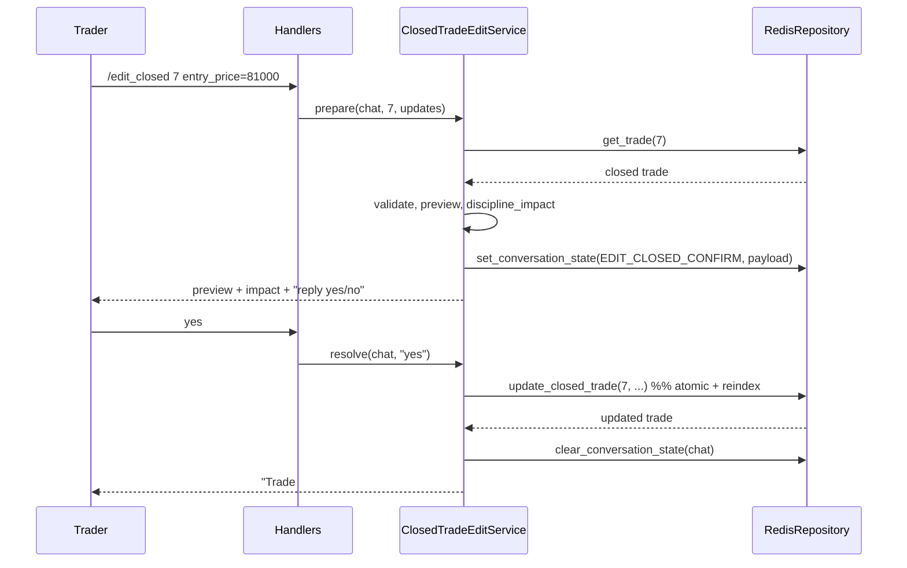

# Design: Edit Closed Trade Command

## Overview

`/edit_closed` lets the trader correct fields of a `CLOSED` trade in one command, then confirm before the change is written. The feature reuses the bot's existing building blocks: the `@whitelisted/@safe_handler` command pattern, the per-chat conversation-state machine for the confirm step (the same mechanism `/new` uses for its `CONFIRM`), the shared field validators, the WATCH/MULTI/EXEC atomic-write pattern, and the standard realized-P&L formula. Because closed trades feed the consecutive-loss streak and the size cap, the command computes a *preview* — including how the streak and cap move — and persists nothing until the trader replies to confirm.

The shape is: one command call builds and stores a *pending edit*; one free-text reply (`yes`/`no`) applies or discards it.

## Architecture

Stack is unchanged: Python 3.11+, `python-telegram-bot` v20+, `redis.asyncio`, `pydantic` v2, `structlog`. No new dependencies.

```
/edit_closed <id> f=v ...
        │
        ▼
TelegramHandlers.edit_closed ──► ClosedTradeEditService.prepare()
        │                               │  parse + validate + build preview Trade
        │                               │  compute discipline impact (pure)
        │                               ▼
        │                        RedisRepository.set_conversation_state(EDIT_CLOSED_CONFIRM,
        │                               {trade_id, updates})    ── pending edit, TTL
        ▼
   reply: preview + impact + "reply yes/no"

(later) free text "yes"
        │
        ▼
TelegramHandlers.text_message ──► ClosedTradeEditService.resolve()
                                        │  on yes: RedisRepository.update_closed_trade(...)
                                        │          (atomic write + reindex zsets)
                                        │  on no : clear_conversation_state
                                        ▼
                                  reply: updated trade / cancelled
```

The new `ClosedTradeEditService` owns the pending-edit lifecycle so that `TradeFormService` (which owns `/new`) is left untouched. Both services read and write the single per-chat conversation slot, so they are mutually exclusive by design (see Key Flows).

## Components and Responsibilities

### `TelegramHandlers.edit_closed` (`src/bot/handlers.py`)
- **Responsibility:** parse `/edit_closed <trade_id> field=value [...]`, delegate to `ClosedTradeEditService.prepare`, reply with the preview-and-confirm message or an error.
- **Key interface:** `async def edit_closed(self, update, context) -> None`, decorated `@whitelisted @safe_handler`. Argument parsing mirrors the existing `edit` handler (first arg = id, remaining args split on the first `=`).
- **Requirements served:** R1.1–R1.6, R5.2.

### `TelegramHandlers.text_message` (`src/bot/handlers.py`, modified)
- **Responsibility:** before routing free text into `TradeFormService.handle_input`, give `ClosedTradeEditService.resolve` first claim when the active conversation step is `EDIT_CLOSED_CONFIRM`.
- **Key interface:** unchanged signature; adds a dispatch check on the loaded conversation step.
- **Requirements served:** R5.4, R5.5, R5.6.

### `ClosedTradeEditService` (new, `src/bot/edit_closed.py`)
- **Responsibility:** the whole pending-edit lifecycle — validate the requested edit against a loaded closed trade, build the preview `Trade`, compute discipline impact, store/load/clear the pending edit in conversation state, and apply it on confirm.
- **Key interfaces:**
  - `async def prepare(chat_id, trade_id, raw_updates: dict[str,str]) -> EditPrepareResult` — loads the trade; rejects if missing (R1.4), not `CLOSED` (R1.5), or naming a non-editable field (R1.6); coerces and validates each field with the shared validators (R2.3–R2.9); enforces closed-trade invariants on the resulting trade (R3); recomputes `realized_pnl` if a P&L field changed (R4.1–R4.2); computes discipline impact (R5.3); persists the pending edit and returns the preview message.
  - `async def resolve(chat_id, text) -> EditResolveResult | None` — returns `None` if no edit-confirm is pending; on affirmative reply applies the edit (R5.5); on negative reply or anything else discards it (R5.6).
  - `def _preview_trade(current: Trade, updates: dict) -> Trade` — pure construction of the post-edit `Trade` (also the validation gate via the pydantic model).
- **Requirements served:** R1.4–R1.6, R2, R3, R4, R5.1–R5.6.

### Discipline-impact helper (`src/rules/impact.py`, new pure function)
- **Responsibility:** compute streak and size cap **before** and **after** the edit without persisting anything.
- **Key interface:** `def discipline_impact(closed_trades: list[Trade], edited: Trade) -> DisciplineImpact` where `DisciplineImpact` holds `streak_before, streak_after, cap_before, cap_after`. Builds the "after" list by swapping `edited` in by id, then reuses the existing pure streak count and `compute_size_cap` logic over both lists.
- **Requirements served:** R5.3.

### `RedisRepository.update_closed_trade` (new, `src/db/repo.py`)
- **Responsibility:** atomically apply an edit to a trade that is still `CLOSED`, including any re-indexing.
- **Key interface:** `async def update_closed_trade(trade_id, *, updates: dict, recomputed_pnl: float | None) -> Trade | None`. Uses WATCH/MULTI/EXEC: re-reads the trade, aborts (returns `None`) if it is no longer `CLOSED`, writes the merged hash, and — if `opened_at` or `closed_at` changed — rewrites the affected sorted-set scores (`trades:all` keyed by `opened_at`, `trades:closed` keyed by `closed_at`). Validates the merged record through the `Trade` model before the write commits.
- **Requirements served:** R3.4, R4.3, R5.5, plus index integrity.

### Formatting (`src/bot/formatting.py`, additions)
- **Responsibility:** centralized copy for every `/edit_closed` reply.
- **Key functions:** `edit_closed_usage()`, `edit_closed_not_found(trade_id)`, `edit_closed_not_closed(trade_id)` (suggests `/edit`), `edit_closed_invalid_field(field)`, `edit_closed_validation_error(field, message)`, `edit_closed_preview(changes, recomputed_pnl, impact, pnl_override_warning: bool)`, `edit_closed_applied(trade, changed_fields)`, `edit_closed_cancelled()`. Adds `/edit_closed` to `help_overview()` and the `help_map`.
- **Requirements served:** R1.3, R4.3 (override warning), R5.2, R6.

### Command registration (`main`/application builder)
- **Responsibility:** register `CommandHandler("edit_closed", handlers.edit_closed)`.
- **Note:** the registered token is `edit_closed` (underscore) — Telegram command names admit only letters, digits, and underscores, so `/edit-closed` is not a valid command.
- **Requirements served:** R1.1.

## Data Model

No new persisted entity. The pending edit rides on the existing conversation slot.

| Store | Key | Shape | Notes |
|-------|-----|-------|-------|
| Conversation state | `conversation:{chat_id}` | `state=EDIT_CLOSED_CONFIRM`, `partial_trade_json={"trade_id":N,"updates":{...},"recomputed_pnl":x}` | Reuses `ConversationState`; `partial_trade_json` is already a free JSON blob. TTL = existing form timeout. |
| Trade | `trade:{id}` | unchanged hash | Edited in place on confirm. |
| Index | `trades:all` (zset by `opened_at`) | unchanged | Re-scored if `opened_at` edited. |
| Index | `trades:closed` (zset by `closed_at`) | unchanged | Re-scored if `closed_at` edited. |

New enum value: `ConversationStep.EDIT_CLOSED_CONFIRM`.

**Editable fields (R2.1):** `direction, size_usdt, leverage, leverage_override_reason, entry_price, invalidation_price, max_loss_usdt, regime, thesis, opened_at, closed_at, close_price`.
**Never editable here (R2.2):** `id, status, realized_pnl, size_reduction_enforced`. (`realized_pnl` is derived in R4 or set via `/setpnl`.)

**Realized-P&L formula (R4.1):** `realized_pnl = (close_price − entry_price) × (size_usdt / entry_price) × sign`, `sign = +1` long, `−1` short — the same `_calculate_realized_pnl` already used at close. Recomputed only when `direction`, `size_usdt`, `entry_price`, or `close_price` is among the edits.

## Key Flows

**1 — Prepare an edit**
1. Trader sends `/edit_closed 7 entry_price=81000 regime=range`.
2. Handler parses id `7` and `{entry_price: "81000", regime: "range"}`; empty/malformed → usage reply (R1.3).
3. Service loads trade 7. Missing → not-found (R1.4). Not `CLOSED` → not-closed reply suggesting `/edit` (R1.5). Unknown field → invalid-field reply (R1.6).
4. Each value is coerced and validated by the shared validators; a failure returns a field-specific error and stores nothing (R2.3–R2.8).
5. Service builds the preview `Trade` (merged + pydantic-validated), which enforces invalidation side, the leverage-override rule, and closed-field presence (R3.1–R3.4); `closed_at < opened_at` is rejected (R3.5).
6. If a P&L field changed, `realized_pnl` is recomputed (R4.1); if a prior `/setpnl` override is being overwritten, the preview flags it (R4.3).
7. `discipline_impact` computes streak/cap before and after (R5.3).
8. Service writes conversation state `EDIT_CLOSED_CONFIRM` with the pending payload (R5.1, R5.4) and replies with changes (old→new), recomputed P&L, impact, and a confirm prompt (R5.2).

**2 — Confirm**
1. Trader replies `yes`.
2. `text_message` sees the active step is `EDIT_CLOSED_CONFIRM` and routes to `ClosedTradeEditService.resolve` (R5.4).
3. `resolve` calls `update_closed_trade` (atomic; re-indexes zsets if timestamps changed), clears conversation state, and replies with the updated trade (R5.5).
4. If the trade is no longer `CLOSED` at write time (WATCH abort), the edit is discarded with an explanatory reply.

**3 — Decline / lapse**
- A reply of `no` (or `/cancel`) clears the pending edit and confirms cancellation (R5.6).
- If the confirm TTL elapses, the pending edit expires with the conversation slot; the next reply finds no pending edit and falls through to normal handling.



## Error Handling

| Condition | Response | Req |
|-----------|----------|-----|
| No id / no `field=value` pairs | usage message | R1.3 |
| Trade id absent | not-found, no change | R1.4 |
| Trade not `CLOSED` | "only edits closed trades; use /edit" | R1.5 |
| Non-editable field named | identify field, no change | R1.6, R2.2 |
| Field fails validator | field-specific error, no change | R2.3–R2.8 |
| Invalidation on wrong side after edit | reject (pydantic), no change | R3.1 |
| Leverage ≥ 20 without a valid reason | reject, no change | R3.2 |
| `closed_at` < `opened_at` | reject, no change | R3.5 |
| `/new` form already active | refuse to prepare; ask to `/cancel` first | R5.4 (slot exclusivity) |
| Trade changed status before confirm | discard pending edit, explain | R5.5 |
| `no` / `/cancel` / TTL lapse | discard, no change | R5.6 |

A pending edit never mutates the trade; only `update_closed_trade` writes, and only after explicit confirmation (R5.4).

## Testing Strategy

**Unit (pure, no Redis)**
- `discipline_impact`: streak/cap before vs. after for edits that (a) flip a loss to a win, (b) change winner sizes, (c) leave P&L untouched. (R5.3)
- Preview construction: every validator path and each invariant rejection — wrong invalidation side per direction, leverage-override presence/clearing, `closed_at < opened_at`, closed-field presence. (R2, R3)
- P&L recompute: triggered iff `direction/size_usdt/entry_price/close_price` changes; override-overwrite flag set when prior `/setpnl` value differs. (R4)

**Integration (real Redis)**
- `update_closed_trade`: only editable fields change; non-editable preserved; `CLOSED` precondition enforced; `trades:all` re-scored on `opened_at` edit and `trades:closed` re-scored on `closed_at` edit, verified via `list_closed_trades` ordering. (R2.9, R3.4, index integrity)
- Conversation exclusivity: `/edit_closed` refused while a `/new` form is active and vice-versa. (R5.4)

**End-to-end (handler + fake repo)**
- Full happy path: prepare → preview shows old→new + impact → `yes` → persisted. (R5.1–R5.5)
- Decline path and not-closed/`/edit` redirect. (R1.5, R5.6)
- `/help` overview lists `/edit_closed`; `/help edit_closed` returns format and fields. (R6)
