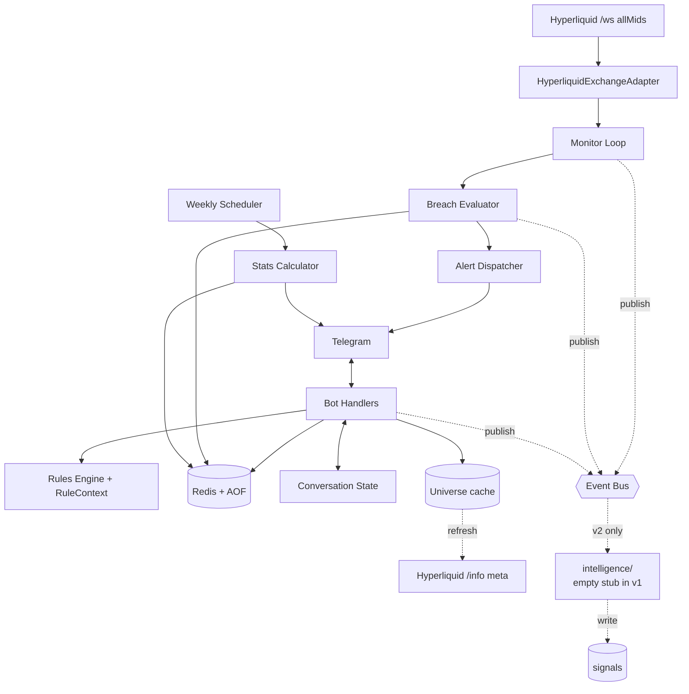

# Design: Multi-Asset Support (Hyperliquid)

## 1. Technical Summary

This change converts the bot from a single-instrument (BTCUSDT via Binance)
monitor into a multi-instrument (any Hyperliquid perp) monitor, without
altering its identity as a deterministic, monitoring-only discipline tool.

The architectural shape is unchanged: one Python service, two cooperating
asyncio loops (Telegram + monitor), Redis as the sole datastore, the same
discipline rules in `src/rules/`, the same conversational form, the same
escalation cadence, the same `/health`, `/stats`, and `/edit_*` surfaces.

What changes is concentrated in three seams:

1. **The exchange adapter.** `binance.py` and the `bybit.py` stub are
   removed; a new `hyperliquid.py` adapter consumes the public
   `wss://api.hyperliquid.xyz/ws` `allMids` stream and yields per-symbol
   ticks. A small REST client on the same module fetches the perpetuals
   universe from `https://api.hyperliquid.xyz/info` (`{"type":"meta"}`)
   for symbol validation.
2. **The tick shape.** A `Tick` now carries `symbol` in addition to
   `price` and `ts`. The monitor matches each open trade to the right
   symbol's mid price out of one shared subscription, rather than running
   one feed per symbol.
3. **Trade identity.** `Trade` and `TradeDraft` gain a required
   `symbol: str` field. The `/new` form acquires a new first step
   (`SYMBOL`) that consults a cached universe and rejects unlisted
   symbols at entry. Sizing and `/streak` filter closed trades by symbol
   (per-symbol streak per R5.4–R5.6).

Existing v1/v2 behavior — the breach evaluator, the alert dispatcher and
escalation cadence, the monitor-health subsystem with its tiered
monitor-down alerts, the heartbeat, the stats calculator, the weekly
report, the `/edit` and `/edit_closed` commands, the REQ-010 intelligence
boundary — is preserved unchanged in meaning. Where these subsystems
touch a trade's instrument, they now read `trade.symbol` instead of
assuming `BTCUSDT`.

Stack additions: none. The Hyperliquid adapter reuses `websockets` for the
stream and adds `httpx` to call the `info` REST endpoint. No SDK
dependency, no new datastore.

## 2. Architecture



- **Frontend:** Telegram only.
- **Backend:** one process, two coroutines plus the existing schedulers.
- **Database:** Redis (unchanged). Trade hash gains one field (`symbol`).
- **Runtime:** Docker Compose, unchanged.
- **External integrations:** Telegram, Hyperliquid public `info` REST, Hyperliquid public `ws` `allMids`. No Binance, no Bybit, no API keys.
- **Auth:** chat-ID whitelist (unchanged).
- **Observability:** structlog JSON to stdout (unchanged). New stable event names: `hyperliquid_connected`, `hyperliquid_disconnected`, `hyperliquid_stale`, `hyperliquid_reconnected`, `universe_refreshed`, `universe_refresh_failed`, `symbol_rejected`.

## 3. Data Model

The Redis key contract is preserved. Only the `trade:{id}` hash changes.

### 3.1 `trade:{id}` hash — one new field

| Field | Type | Notes |
|---|---|---|
| `symbol` | string | Required. Hyperliquid perpetual symbol from the `meta` universe (e.g. `BTC`, `ETH`, `HYPE`, `AUDUSD`). Case-normalized to canonical form (uppercase) before validation and storage. Immutable after trade creation (R1.5 in requirements). |

Every other field on the trade hash is unchanged. Indexes (`trades:all`, `trades:status:*`, `trades:closed`) are unchanged.

### 3.2 `TradeDraft` — one new optional field

`TradeDraft` (the in-progress form data) gains an optional `symbol: str | None`. The validated `Trade` model requires it.

### 3.3 Universe cache (Redis)

Symbol validation needs a recent list of valid Hyperliquid perp symbols. The list is cached in Redis behind a single key.

| Key | Type | Notes |
|---|---|---|
| `hyperliquid:universe:perps` | string (JSON) | A JSON array of canonical perp symbol names plus a stored `fetched_at` ISO timestamp. Refreshed on a configurable interval; treated as authoritative until refresh succeeds. Cleared by ops if needed. |

This key lives outside the trade/breach/alert/conversation namespaces; the intelligence boundary check is unaffected.

### 3.4 Conversation step

A new `ConversationStep.SYMBOL` is added at the **start** of the `/new` flow:

```
IDLE → SYMBOL → DIRECTION → SIZE → LEVERAGE [→ LEV_OVERRIDE] → ENTRY
     → INVALIDATION → MAX_LOSS → REGIME → THESIS → CONFIRM → IDLE
```

`/cancel` and the form-timeout reaper behave identically to today.

## 4. API Design

No HTTP API. The Telegram command surface changes only in display.

### 4.1 New / changed prompts

- `/new` first prompt: `Symbol? (e.g. BTC, ETH, HYPE, AUDUSD)`.
- Symbol rejection: `Unknown symbol 'X'. Use a Hyperliquid perpetual symbol — try /open for examples, or /help symbol.` Form stays on `SYMBOL`.
- Universe unavailable (no cache): `Hyperliquid market list unavailable. Try again in a few seconds.` Form stays on `SYMBOL`; no trade created.
- Trade confirmation: includes symbol on the first line, e.g. `Trade #12 (HYPE long) committed and monitored.`

### 4.2 `/streak`

`/streak` switches from one global line to one line per symbol with closed history (R5.6). When no symbol has any closed trades, the reply is `No closed trades yet on any symbol.`

### 4.3 `/open`, alerts, edits

`/open` lists each trade with its symbol. Breach alerts identify the trade by `#id` and symbol. `/closed`, `/justify`, `/setpnl`, `/edit`, and `/edit_closed` identify trades by id (unchanged) and operate on any symbol; their reply messages echo the symbol.

### 4.4 `/health`

Adds the Hyperliquid feed view:

- websocket status: `connected | disconnected | stale | unknown`
- last `allMids` update age in seconds
- universe cache freshness (age of last successful `meta` fetch)
- last Hyperliquid error (if any)
- existing Redis fields are unchanged

## 5. Frontend Design

The conversational state machine gains one leading step:

```
IDLE → SYMBOL → DIRECTION → SIZE → LEVERAGE [→ LEV_OVERRIDE] → ENTRY
     → INVALIDATION → MAX_LOSS → REGIME → THESIS → CONFIRM → IDLE
```

**Why symbol first.** Validation may need a `meta` round-trip; rejecting an unknown symbol after eight other fields would be cruel. Symbol-first also lets `LEVERAGE` (and any later symbol-aware logic) operate with the symbol already in `TradeDraft`.

**Copy guidelines** are preserved: prompts are short and imperative; validation rejections name the field, the rule, and an example; confirmations echo trade id, symbol, and the enforced parameters.

**Per-symbol streak in `/streak`.** Reply format:

```
BTC: streak 2, size cap 2500 USDT
ETH: streak 0, no cap
HYPE: streak 1, no cap
```

Symbols with no closed history are omitted. If the user has no closed history at all, the reply is the empty-state line above.

## 6. Backend Design

### 6.1 Module layout (delta only)

```
src/
  exchange/
    base.py                   # unchanged
    hyperliquid.py            # NEW: ws (allMids) + REST (info/meta)
    binance.py                # DELETED
    bybit.py                  # DELETED
  bot/
    forms.py                  # adds SYMBOL handler; reorders prompts
    formatting.py             # adds prompt_symbol(), symbol-aware copy
  models/
    trade.py                  # Trade.symbol (required), TradeDraft.symbol
    conversation.py           # ConversationStep.SYMBOL
  rules/
    validation.py             # validate_symbol(value, universe)
    sizing.py                 # filter closed trades by symbol
    impact.py                 # filter closed trades by symbol
  monitor/
    monitor.py                # iterate open trades, look up tick by symbol
    breach.py                 # unchanged
  db/
    repo.py                   # universe cache get/set, no other contract changes
    keyspace.py               # hyperliquid_universe_key()
  config.py                   # remove SYMBOL; add Hyperliquid URLs/intervals; default leverage 10
  app.py                      # wire HyperliquidExchangeAdapter
```

`src/rules/` stays pure. `src/db/repo.py` remains the only Redis-touching module.

### 6.2 `HyperliquidExchangeAdapter`

Implements the existing `ExchangeAdapter` ABC: `stream_ticks()`, `healthy()`, `close()`. Adds an internal connection-state publisher (unchanged from current shape) and one new method used only at form time:

```python
async def fetch_universe(self) -> list[str]:
    """POST to {info_url} with {"type":"meta"}, return canonical perp names."""
```

**Stream behavior**

- Connect to `wss://api.hyperliquid.xyz/ws` (configurable URL).
- On connect, send `{"method":"subscribe","subscription":{"type":"allMids"}}`. Await the `subscriptionResponse` ack (logged, no behavior change on absence — the first data frame is the real signal).
- For each incoming `{"channel":"allMids","data":{"mids":{"BTC":"...","ETH":"...", ...}}}` frame, emit **one `Tick` per symbol** in the frame. Each `Tick` carries `symbol`, `price` (parsed `float`), and the adapter-side receive time as `ts`. Hyperliquid's `allMids` does not stamp a per-symbol timestamp, so the receive time is the authoritative monitor timestamp.
- Apply the same exponential-backoff reconnect (1, 2, 4, 8, 16, 32, 60s steady) and the same staleness threshold (no frame in N seconds → force reconnect). On reconnect, resubscribe and emit a `RECONNECTED` connection event with the gap duration so the monitor-health subsystem can run gap-recovery re-evaluation (existing logic).

**`Tick` shape (changed)**

```python
@dataclass(frozen=True)
class Tick:
    symbol: str
    price: float
    ts: datetime
```

This is a contract change to `src/exchange/base.py`. The monitor and tests are updated to consume the new field. Outside the exchange/monitor/test surface, `Tick` is not referenced.

**`fetch_universe`**

- POST `{"type":"meta"}` to `https://api.hyperliquid.xyz/info` (configurable URL) with `Content-Type: application/json`.
- Parse `data["universe"]` → list of `{"name": "...", ...}` entries.
- Filter to entries representing actively listed perps (omit any with a `isDelisted: true` flag if present; otherwise include all).
- Return the list of canonical `name` values.
- Timeout: small, on the order of 3–5 seconds (configurable). On failure, raise; the universe cache layer decides whether to serve a stale cached value or fail the form.

### 6.3 Universe cache and validation

Symbol validation needs sub-second response at form time. Doing a `meta` fetch on every `/new` would add a network round-trip and a failure mode to a flow that today touches only Redis.

**Cache shape and refresh policy**

- The repository owns `hyperliquid:universe:perps`. Stored value is a JSON document `{"symbols": ["BTC","ETH",...], "fetched_at": "ISO-8601"}`.
- A background refresh runs on the configured `HYPERLIQUID_UNIVERSE_REFRESH_SECONDS` interval (default: 300s). On success, replaces the cached value atomically.
- The form layer reads the cache synchronously. If the cache is missing **or** older than the staleness threshold, it triggers a synchronous refresh as part of the user's input handling. On refresh failure with no usable cache → reject the input with "market list unavailable" (R2.4). On refresh failure with a usable cache → validate against the cache and continue (R2.5).

**Validator**

`validate_symbol(value: object, universe: set[str]) -> str` lives in `src/rules/validation.py` alongside the other field validators. It:

- Rejects non-strings and empty strings.
- Trims and uppercases the value (canonical Hyperliquid perp form).
- Checks exact membership in `universe`.
- Raises `ValueError` with the field-named error message on mismatch (existing validator pattern).

The form layer is the only caller; the rule itself is symbol-agnostic.

### 6.4 Monitor loop changes

Today the monitor evaluates every tick against every open trade. With one shared `allMids` feed, each frame holds many symbols, and each open trade cares about only one of them.

**New per-frame loop**

```text
for each open trade t in trades_loaded_at_startup_or_open_event:
    mid = frame.mids.get(t.symbol)
    if mid is None:
        continue                           # R3.3: no false breach
    update alerts.update_trade_price(t.id, mid)
    if is_breach(t.direction, t.invalidation_price, mid):
        create_breach(t.id, breach_price=mid, detected_at=frame_ts)
        if newly created:
            alerts.trigger_breach_alert(t, breach, current_price=mid)
            event_bus.publish(BreachDetected{...})
```

The shared subscription stays up as long as at least one trade is open; when the last trade closes, the monitor MAY close the connection and re-establish it the next time a trade is opened (R3.7). The simplest acceptable v1 implementation keeps the connection up always once started — this is allowed.

**Tick events on the bus.** The `tick` event on the event bus already carries `price`; it gains `symbol`. The intelligence layer remains empty in v1, so this is a forward-compatible payload change.

### 6.5 Sizing and impact, made symbol-aware

Per R5.4–R5.6, the consecutive-loss size cap is per-symbol.

- `compute_size_cap(ctx, threshold, factor)` continues to take a `RuleContext`. The orchestrator passes only the candidate symbol's closed trades into `ctx.recent_trades`. No change to the cap math; only the input set narrows.
- `consecutive_loss_count(ctx)` likewise scopes to the candidate symbol.
- `discipline_impact(closed_trades, edited, ...)` (used by `/edit_closed` preview) takes the **same-symbol** subset of closed trades for both the "before" and the "after" set. Cross-symbol trades are not part of the impact preview because they cannot move the symbol-local streak.
- The form's size step calls these with the symbol already in the draft (because `SYMBOL` is now the first step).

`/streak` walks all closed trades, groups by symbol, and renders one line per symbol with closed history.

### 6.6 Repository touchpoints

- `RedisRepository.list_closed_trades(symbol: str | None = None)` gains an optional `symbol` filter. Default behavior (no filter) is unchanged. Callers that want per-symbol scoping pass the symbol; today's callers (stats, weekly report) keep the default and operate on all trades.
- `RedisRepository.consecutive_loss_count(symbol: str | None = None)` gains the same optional filter.
- `RedisRepository.get_universe()` / `set_universe(symbols, fetched_at)` read/write the cache key.
- No new indexes by symbol in v1: scanning the closed-trade zset and filtering in Python is fast enough at single-user scale. If volume ever justifies it, a future change can add a `trades:closed:symbol:{S}` zset behind the same repository surface.

### 6.7 Configuration changes (additions and deletions)

Deleted (no longer meaningful):

- `SYMBOL` (was `BTCUSDT`). Now a per-trade field.

Defaults changed:

- `LEVERAGE_BLOCK_THRESHOLD`: `10` (was `20`).
- `EXCHANGE`: removed; the bot has one exchange.

Added:

- `HYPERLIQUID_WS_URL` (default `wss://api.hyperliquid.xyz/ws`).
- `HYPERLIQUID_INFO_URL` (default `https://api.hyperliquid.xyz/info`).
- `HYPERLIQUID_UNIVERSE_REFRESH_SECONDS` (default `300`).
- `HYPERLIQUID_UNIVERSE_STALE_SECONDS` (default `900`; when the cache is older than this and a refresh succeeds, the value is used; if a refresh fails and the cache is older than this, validation degrades to "use stale cache" rather than block — see §3 of requirements).
- `HYPERLIQUID_FEED_STALE_SECONDS` (default `30`; matches today's behavior).
- `HYPERLIQUID_FEED_REQUEST_TIMEOUT_SECONDS` (default `5`).

Unchanged in meaning: alert cadence, monitor-down tiers, heartbeat, Redis, timezone, Telegram whitelist.

### 6.8 Restart and resubscription

On process restart:

- The monitor loads all open trades and starts the single `allMids` subscription.
- Unresolved breaches re-arm in the alert dispatcher (existing behavior; symbol comes from the loaded trade record).
- The universe cache is read from Redis. If absent (cold container, wiped data), the first `/new` triggers a synchronous fetch.

## 7. Security Design

- **Auth:** chat-ID whitelist (unchanged).
- **External calls:** only `wss://api.hyperliquid.xyz/ws` and `https://api.hyperliquid.xyz/info`. Public endpoints, no API key, no signing. Both URLs are TLS-only.
- **Input handling:** symbols are validated against an exact-match set; the input is uppercased and stripped before lookup. No code path treats a user-typed symbol as Redis key text — symbols are stored as hash values on the trade record and are not interpolated into Redis key names.
- **Universe responses:** parsed defensively; any non-string `name` entry is dropped; unknown extra fields in the JSON are ignored.
- **Allowed network egress:** the runtime's network policy is extended to permit `api.hyperliquid.xyz`. The Binance host is removed.
- **Telegram impersonation, log secrets, etc.:** unchanged.

## 8. Error Handling

| Condition | Handling |
|---|---|
| `/new` symbol step, unknown symbol | Inline reject, stay on `SYMBOL`, do not advance. |
| `/new` symbol step, universe fetch fails and no cache | Reject input with "market list unavailable, try again". Form remains on `SYMBOL`; no trade created. |
| `/new` symbol step, universe fetch fails but cache exists | Use the cache. Log `universe_refresh_failed`. |
| Universe stale on a successful refresh | Replace cache atomically. Log `universe_refreshed`. |
| `allMids` frame missing an open trade's symbol | Skip that trade for that frame. No false breach. |
| `allMids` frame includes a non-numeric / malformed mid | Skip that symbol for that frame; log. |
| WS disconnect | Reconnect with the documented backoff; resubscribe to `allMids` on reconnect; tiered monitor-down alerting per existing R-009 behavior. |
| Coverage gap > 60s on reconnect | First post-reconnect frame triggers re-evaluation of every open trade (existing gap-recovery callback into the monitor). |
| Hyperliquid HTTP 4xx/5xx on `info/meta` | Treat as fetch failure for cache purposes; log. |
| Hyperliquid HTTP timeout | Same as fetch failure. |
| Process restart with open trades | Monitor resumes; unresolved breaches re-arm (unchanged). |

User-facing errors stay short and name the failing field.

## 9. Testing Strategy

### 9.1 Unit (no Redis, no network)

- `validate_symbol`: accepts canonical names, rejects unknown / empty / non-string; case-insensitive match by normalizing input then exact-matching the universe set.
- `compute_size_cap` and `consecutive_loss_count`: per-symbol scoping — a streak on `BTC` does not cap an `ETH` trade; a winner on `BTC` does not raise the `ETH` cap; mixed multi-symbol history produces correct per-symbol streaks.
- `discipline_impact`: same-symbol filter — editing a closed `BTC` trade does not move the `ETH` streak or cap shown in the preview.
- `Tick` round-trip: new `symbol` field carried end to end by the breach evaluator and alert dispatcher.

### 9.2 Integration (real Redis, no network)

- `RedisRepository.list_closed_trades(symbol=...)`: returns only the requested symbol's history, sorted by close time.
- `RedisRepository.consecutive_loss_count(symbol=...)`: per-symbol streak under interleaved multi-symbol closes.
- Universe cache: write, read, age computation, atomic refresh.

### 9.3 Adapter tests (mock websocket / HTTP)

- `HyperliquidExchangeAdapter.stream_ticks` against a fake websocket scripted with:
  - one `allMids` frame containing several symbols → yields one `Tick` per symbol in order.
  - a frame missing a previously-seen symbol → no `Tick` for it on that frame.
  - a frame with a malformed price → skipped; logged.
  - a disconnect → backoff sleep recorded, resubscribe sent on reconnect, `RECONNECTED` event emitted with the gap duration.
  - a stale gap (no frame in `HYPERLIQUID_FEED_STALE_SECONDS`) → forced reconnect; `STALE` event emitted.
- `HyperliquidExchangeAdapter.fetch_universe` against a fake `info/meta` JSON: returns canonical names; tolerates extra fields; tolerates and skips malformed entries; raises on HTTP error / timeout.

### 9.4 Bot integration (Redis + mocked Telegram)

- `/new` happy path: symbol → direction → … → CONFIRM commits a trade with the chosen symbol.
- `/new` symbol rejection on typo: form stays on `SYMBOL`, no state advance.
- `/new` symbol rejection when universe fetch fails and no cache exists.
- `/new` symbol acceptance using stale cache when refresh fails.
- `/streak` after closed trades on three different symbols: one line per symbol, in deterministic order.
- `/open` and breach alerts include symbol.

### 9.5 End-to-end (fake adapter + scripted feed)

- Multi-symbol breach: open trades on `BTC` and `ETH`; feed a frame where `ETH` breaches but `BTC` is fine → one breach record, one alert, both keyed to the right trade.
- Symbol filtering safety: a frame missing one symbol while another breaches → only the present-symbol trade is evaluated; no false breach on the missing one.
- Restart with open trades on multiple symbols: monitor resumes single subscription; first post-restart frame evaluates each open trade against its own symbol.

### 9.6 Coverage

The existing `src/rules/` and `src/monitor/` ≥85% coverage gate continues to apply. New code in `src/exchange/hyperliquid.py` is exercised by §9.3.

## 10. Migration / Rollout Plan

Clean break per R8 / NG3.

**Cutover sequence**

1. Stop the running bot.
2. Wipe the Redis data directory (or `redis-cli FLUSHDB` against the bot's database number) — this drops trades, breaches, alerts, conversation state, and any v1 universe key. Trade IDs restart from 1.
3. Deploy the new image. New env vars (`HYPERLIQUID_*`) populated; `SYMBOL` and `EXCHANGE` removed from `.env`; `LEVERAGE_BLOCK_THRESHOLD` is `10` unless overridden.
4. `docker compose up -d`. Startup verifies Redis is reachable and AOF is enabled (existing checks).
5. First Telegram interaction: `/health` should show `websocket: connected` once a frame arrives, `universe cache: fresh` after the first synchronous or background fetch.
6. Smoke test: `/new` on `BTC`, then `/cancel`. Then `/new` on a non-crypto perp like `AUDUSD` (if listed) to confirm symbol breadth works.

**Rollback**

If something is wrong with the new adapter, the safest action is to stop the stack (`docker compose down`) and roll the image back to the prior tag. Because of the clean break, there is no v1 data to recover. The runbook will document the rollback tag and the env-var diff.

**Documentation**

- `README.md` updates: remove BTC-only language; document the symbol field; document the new env vars; remove references to Binance/Bybit.
- `RUNBOOK.md` updates: the universe-cache-stale case under operational issues; the Hyperliquid feed status in `/health`; the clean-cutover procedure.

## 11. Alternatives Considered

- **Per-symbol websocket subscriptions.** Subscribe to `trades` per open symbol instead of `allMids`. Rejected: `allMids` is one connection regardless of how many symbols are open, matches the bot's mid-price evaluation model, and is the same data Hyperliquid uses for its own UI mids. Per-symbol `trades` would multiply connections and require a new "no trade for this symbol in N seconds" definition of staleness per symbol.
- **Validate symbols only when the trade is committed.** Rejected: failing at the end of an eight-field form is poor UX and would let a user enter a full plan before discovering the symbol is wrong. Symbol-first is cheap to validate and makes downstream steps (leverage, sizing) symbol-aware.
- **Cross-symbol loss streak (the original requirements draft).** Rejected after user confirmation: a per-symbol streak better reflects asset-specific behavior. The downside is that switching symbols can launder a streak — accepted by the user as the right trade-off.
- **Migrate v1 `BTCUSDT` records to `BTC` instead of wiping.** Rejected by the user as out of scope; the migration would need to also rewrite indexes, the schema version, and any conversation state. A clean break is simpler and safer.
- **Keep Bybit as a future stub.** Rejected: v1.1 multi-exchange is not a stated goal, and the adapter ABC remains generic enough to host another exchange later if needed.

## 12. Implementation Notes for Coding Agents

### Read first

- `requirements.md` for this feature, end to end.
- Hyperliquid websocket docs (`wss://api.hyperliquid.xyz/ws`) and `info` endpoint docs (`{"type":"meta"}`).
- `src/exchange/binance.py` for the existing reconnect/backoff pattern to mirror.
- `src/rules/sizing.py` and `src/rules/impact.py` to understand where the per-symbol filter slots in without disturbing math.

### Implementation order

1. Adapter and `Tick` shape: `src/exchange/hyperliquid.py`, update `src/exchange/base.py` `Tick` to carry `symbol`.
2. Models: add `symbol` to `Trade` and `TradeDraft`; add `ConversationStep.SYMBOL`.
3. Repository: optional `symbol` filter on `list_closed_trades` / `consecutive_loss_count`; universe cache get/set.
4. Validation: `validate_symbol`.
5. Form: insert `SYMBOL` as the first step; reorder prompts; wire universe lookup.
6. Sizing / impact: pass through symbol-scoped closed trades.
7. Monitor loop: per-symbol mid lookup in `process_tick`.
8. Formatting and command output: symbol in `/open`, alerts, edits, confirmations; per-symbol `/streak`.
9. Config and runtime: env vars, `app.py` wiring, removal of Binance/Bybit.
10. Tests at each layer.
11. README / RUNBOOK updates.

### Do NOT assume

- That `allMids` carries a server timestamp — it doesn't. Use the receive time.
- That every open trade's symbol appears in every frame — skip when missing.
- That a symbol typed by the user matches the universe verbatim — normalize first.
- That existing v1 tests with BTCUSDT will still compile — they are part of the clean break and need to be updated to reference `Tick.symbol` and `Trade.symbol`.

### Risks needing extra care

- **Universe race at startup.** A `/new` issued in the first seconds after a cold start may arrive before the first scheduled refresh. Handle by triggering a synchronous refresh inside the form handler when the cache is missing.
- **Per-symbol streak correctness.** Make sure the filter applies to both `compute_size_cap` and `consecutive_loss_count` everywhere they're called (forms, `/streak`, `/edit_closed` impact preview).
- **`Tick` contract change.** Touching `Tick` ripples into every test that constructs one. Update them in the same PR so the suite remains green.
- **Frame size.** `allMids` includes every actively traded coin Hyperliquid lists, not just the user's open ones. Iteration is O(open_trades × 1 dict lookup), not O(coins). Don't accidentally invert that.
